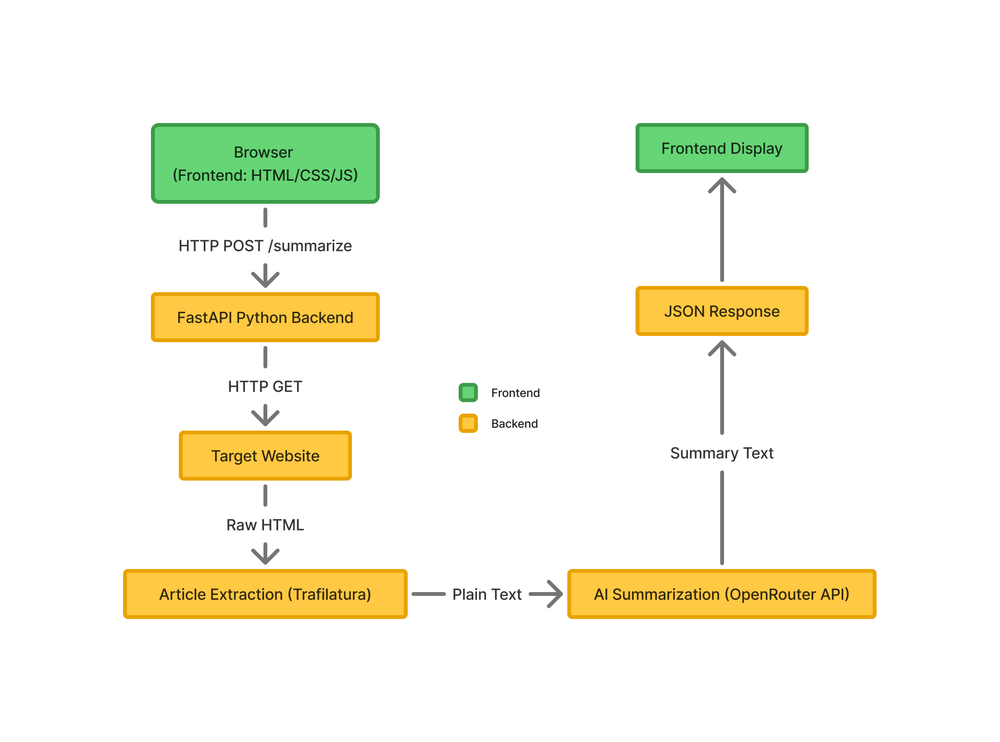

# Overview / Purpose

QuickRead is an article summarizer tool that converts long web articles into digestable bullets, ready to be consumed in under a minute.

QuickRead's goal is to save user time by providing essential text summary without sacrificing facts and figures.

# System Architecture

QuickRead uses a full-stack architecture. The backend server accepts web URLs from the frontend as POST requests, then uses the `trafilatura` Python package's `extract()` function to pull plain text from the HTML body. The extracted text is then processed through `summarize_article()`.

`summarize_article()` sends the extracted text, along with an LLM prompt, to the `openai/gpt-oss-20b:free` LLM model via the OpenRouter API. The LLM returns a summarized version of the article, which gets packaged as a JSON response and sent back to the frontend.

# Components

- **Frontend:** QuickRead's frontend is supported by the following artifacts:
    - `index.html`: Defines the frontend's structure.
    - `style.css`: Designs the elements visible on the frontend. Doesn't execute backend code.
    - `script.js`: Defines how elements on the frontend behave. Connects frontend to the backend.
- **Backend:** QuickRead's backend is responsible for processing user input and sending a response back to the frontend. The backend relies on the following features to process user request:
    - `requests`: Python package that makes HTTP requests.
    - `trafilatura`: Parses raw HTML into plain text.
    - `openai`: Python package to access OpenAI's REST API to access llm model.
    - `extract_article`: Function that extracts plain text from HTML body.
    - `summarize_article`: Function that passes the plain text to an llm, along with a prompt to summarize the text.
    - `fastAPI`: Python framework to build APIs.
    - `pydantic`: Python package to validate data fields and structure.
    - `GET /`: Endpoint reserved for sanity testing of the API. Doesn't influence functionality.
    - `/summarize`: Endpoint that receives POST requests and calls the `exctract_article` and `summarize_article` functions.

# Data Flow

QuickRead accepts and processes data in the following order:

- User inputs a web URL on the frontend. A basic client-side input check runs before the request is sent.
- The frontend makes a POST request to the `/summarize` endpoint. 
- The backend validates the incoming request's structure using the `pydantic` package. Malformed requests are rejected here.
- If the incoming request is valid, the API calls the `extract_article()`.
- The `extract_article()` passes the URL string in the `requests.get()` to fetch the webpage for raw HTML. If the fetch fails here for any reason, the process stops here and the user receives an error message.
- Upon a successful fetch, `response.text` is passed in the `trafilatura.extract()` to extract plain text body, which is then stored in the `article_text` variable.
- The `article_text` along with a text prompt is sent to the `openai/gpt-oss-20b:free` model via OpenRouter API. API rate limiting can affect application performance.
- The llm processes the `article_text` based on the prompt, and returns the summarized text.
- The API server then structures the JSON response, including the summarized text, and sends it back to frontend.
- The user finally receives a summarized web text.

# Technology Stack & Justification

The QuickRead application is built using the following technology stack:

- `requests`: The python `requests` package enables the application to fetch the requested webpage using the user-input URL. The `requests` package was chosen for QuickRead since it's a widely-used, mature package for performing HTTP requests.
- `trafilatura`: The `trafilatura` package extracts plain text from raw HTML body. Just like `requests` package, `trafilatura` readily solves the problem of text extraction from HTML, preventing the need to build a dedicated text extraction functionality.
- `pydantic`: The `pydantic` package validates the data and structure of the incoming request body. With `pydantic`, the application ensures that the incoming url is a string.
- `FastAPI`: This python framework helps setup an API server, connecting the backend with the frontend. FastAPI was chosen based on wide recommendations as the go-to API for beginners. It serves the purpose of connecting the frontend to the backend, which QuickRead requires to accept and process user data. Building an HTTP server while a mature framework like FastAPI already exists is unnecessary for QuickRead's scope.
- `OpenAI`: A python library that allows setting up a client to interact with OpenRouter API and access a llm model for testing.
- `OpenRouter`: Enables QuickRead to access an OpenAI llm model via OpenRouter API. OpenRouter establishes a connection between QuickRead and `openai/gpt-oss-20b:free` llm model.
- `HTML`: Defines the structure and elements present on the frontend. 
- `CSS`: Helps stylize the elements present on the frontend.
- `JavaScript`: Adds behavior to frontend elements, such a button click behavior.
